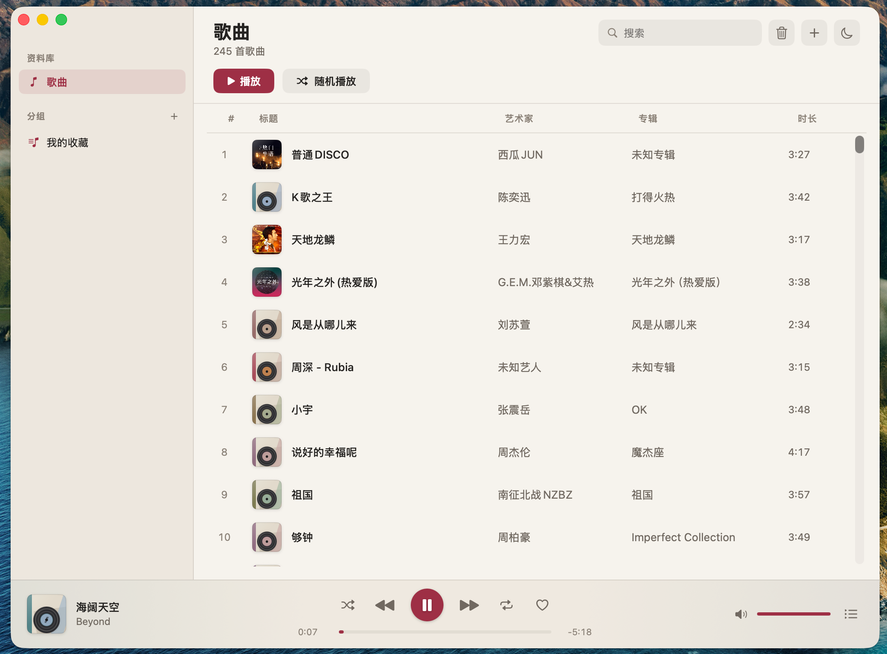
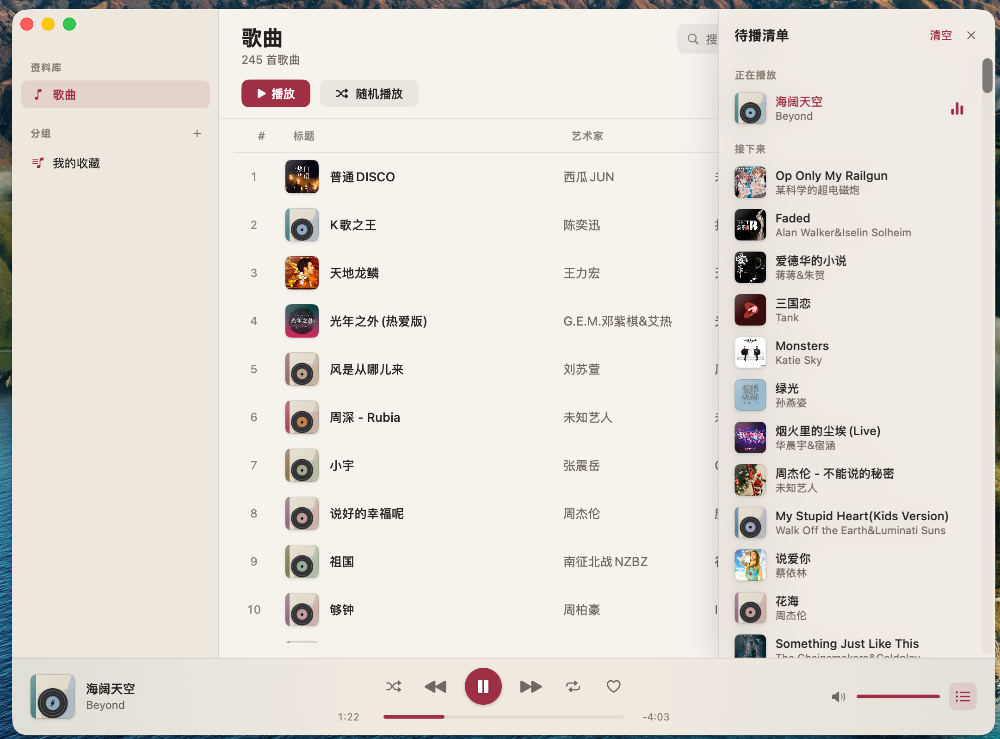
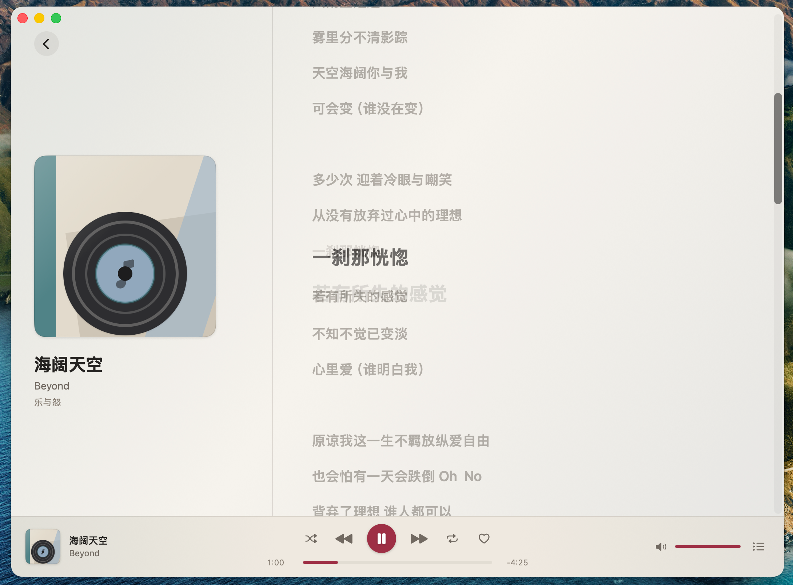
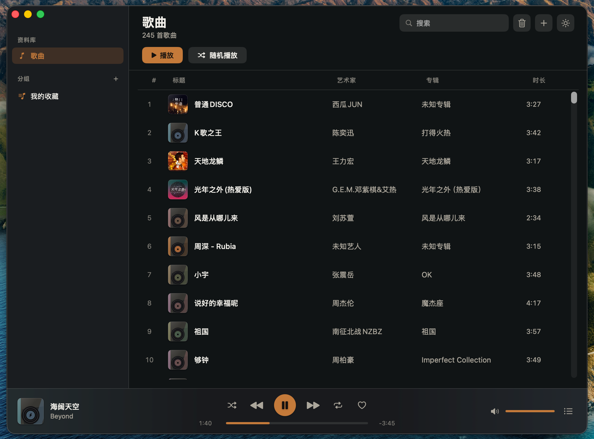

# Crate

Crate 是一个 macOS SwiftUI 本地音乐播放器，专注于导入、整理和播放个人本地曲库。它保留桌面播放器该有的密度和效率：表格曲库、分组管理、底部播放条、待播清单、浅色/深色主题，以及基于同名 `.lrc` 文件的动态歌词页。


## 界面预览

### 浅色主题







### 深色主题



## 功能概览

- 本地曲库导入：支持导入音频文件或文件夹，过滤可播放格式。
- 元数据读取：读取标题、艺术家、专辑、时长和内嵌封面；缺失时回退到文件名和占位封面。
- 同名封面文件：音频无内嵌封面时，自动读取同目录同名 `.jpg`、`.jpeg`、`.png`、`.webp`。
- 同名歌词文件：当前播放歌曲旁存在同名 `.lrc` 时，点击播放条左侧封面进入动态歌词页。
- 动态歌词播放：歌词随播放进度高亮和滚动，点击歌词行可跳转播放位置。
- 曲库浏览：表格展示序号、标题、艺术家、专辑和时长，支持当前播放行高亮。
- 搜索过滤：按标题、艺术家、专辑名实时搜索当前视图。
- 播放控制：支持播放/暂停、上一首/下一首、进度拖动、音量、随机播放和循环模式。
- 待播清单：右侧面板展示当前播放、插播队列和后续曲目。
- 音乐分组：支持创建、重命名、删除、拖动排序，以及将歌曲加入分组。
- 主题配色：浅色主题采用暖白收藏目录气质，深色主题采用石墨器材面板气质。
- 文件可用性处理：标记失效曲目，支持重新定位和批量清理。
- 本地持久化：曲库、分组和主题偏好会在重启后保留。

## 歌词与封面文件约定

Crate 使用音频文件旁的 sidecar 文件，不会把用户的歌词文件复制进应用目录。

```text
Music/
  杨千嬅 - 少女的祈祷.mp3
  杨千嬅 - 少女的祈祷.lrc
  杨千嬅 - 少女的祈祷.jpg
```

- `.lrc`：点击播放条左侧封面时按当前磁盘状态懒加载；补放歌词文件后无需重新导入歌曲。
- 图片封面：导入或启动回填时读取，并作为歌曲封面持久化。
- 歌词解析支持标准 LRC 时间戳、同一行多个时间戳和 `[offset:+/-毫秒]`。

## 快速开始

```bash
swift build
```

编译 SwiftPM target，用于快速检查 Swift/SwiftUI 编译错误。

```bash
swift run Crate
```

通过 SwiftPM 启动应用，适合开发期验证。

```bash
open Crate.xcodeproj
```

用 Xcode 打开项目，处理签名、调试和 App 图标资源。

```bash
Scripts/bundle.sh
```

构建 arm64 Release 并生成本地可测试 app：

```text
build/Crate.app
```

## 测试与验证

提交前建议至少运行：

```bash
swift test
swift build
openspec validate <change-name>
Scripts/bundle.sh
```

涉及 UI、导入、播放、歌词或持久化时，还需要手动验证：

- 空曲库首次启动。
- 文件导入和文件夹导入。
- 重复路径处理。
- 有封面、无封面、同名 sidecar 封面。
- 有同名 `.lrc`、无 `.lrc`、无法解析 `.lrc`。
- 歌词页打开、关闭、自动滚动、点击歌词行跳转。
- 播放/暂停、上一首/下一首、进度拖动、随机和循环。
- 待播清单插播、清空和上下文回归。
- 分组创建、重命名、删除、拖动排序。
- 重启后曲库、分组、封面和主题保留。

## 项目结构

```text
src/
  CrateApp.swift            应用入口
  AppState.swift            曲库、分组、导入、歌词、持久化和全局状态
  PlayerStore.swift         播放状态、播放上下文和待播队列
  PlaybackEngine.swift      AVAudioPlayer 播放封装
  Lyrics.swift              LRC 解析和歌词文件解码
  Views/                    SwiftUI 页面和组件
  Assets.xcassets/          应用图标资源

Tests/CrateTests/
  PlayerStoreTests.swift    播放状态机和持久化测试
  LRCParserTests.swift      LRC 解析器测试
  AppStateLyricsTests.swift 歌词打开、缺失和切歌刷新测试

openspec/
  specs/                    当前产品能力规格
  changes/                  进行中的 OpenSpec 变更
  changes/archive/          已归档变更

Scripts/
  bundle.sh                 生成 build/Crate.app 的本地打包脚本

docs/设计材料/
  原始 Web 原型、样式和设计 token 参考

docs/截图/
  README 使用的应用界面截图
```

## OpenSpec 工作流

行为变更应先创建或更新 OpenSpec change，再实现代码。实现完成后：

1. 同步 delta specs 到 `openspec/specs/`。
2. 准确勾选对应 `tasks.md`。
3. 运行 `openspec validate <change-name>`。
4. 运行 `swift test`、`swift build` 和 `Scripts/bundle.sh`。
5. 将完成的 change 归档到 `openspec/changes/archive/YYYY-MM-DD-<change-name>/`。

## 技术栈

- Swift 5.9+
- SwiftUI
- AVFoundation
- Swift Package Manager
- XCTest
- OpenSpec
